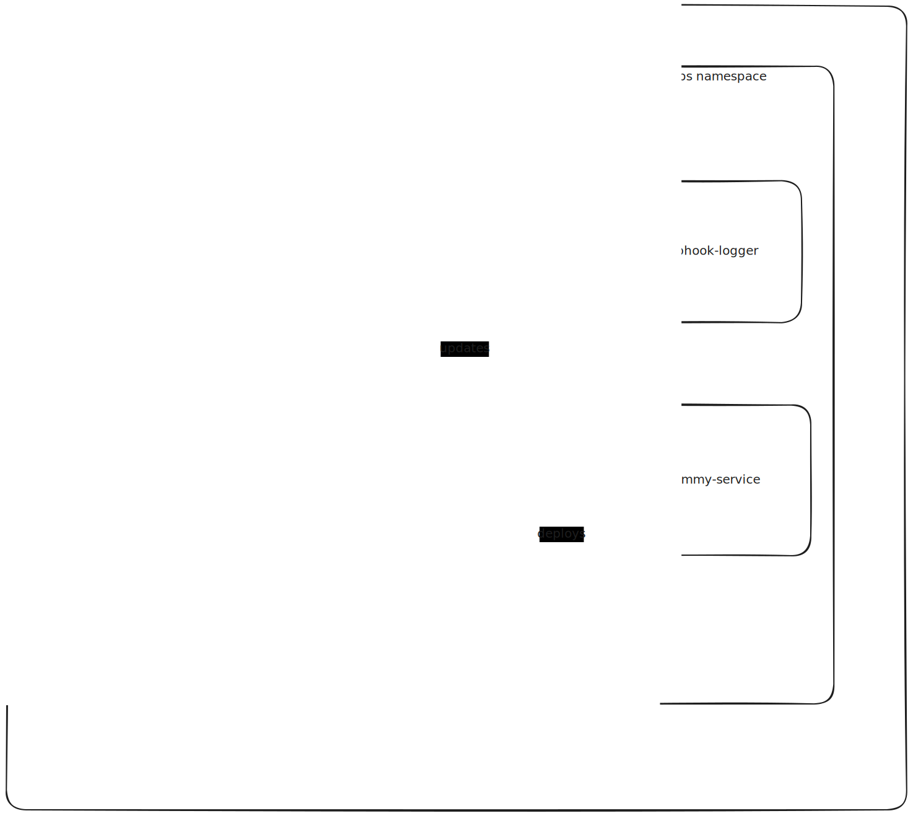

# GitOps with OCI Artifacts

Demonstrates how to configure GitOps using OCI artifacts with Flux. All cluster deployments are managed from a single source of truth stored as OCI images in a registry.

## Architecture Overview



**Registry**: For this demo, a registry runs in-cluster. In production, use a cloud provider registry (ACR, ECR, GCR, etc.).

**GitOps Root**: The `gitops-root` OCI artifact contains all cluster resources - both plain manifests and references to other OCI artifacts. See [oci-artifacts/README.md](oci-artifacts/README.md) for details.

**Infrastructure**: Flux controllers and bootstrap configuration. See [infrastructure/README.md](infrastructure/README.md) for details.

**Notifications**: A webhook logger service prints notification bodies. In production, use Slack, Teams, or other notification providers.

## Quick Start

1. **Setup cluster and infrastructure**:
   ```bash
   make setup
   ```
   This creates a kind cluster, deploys the registry, installs Flux, and pushes the gitops-root artifact.

2. **Deploy dummy-service** (optional):
   ```bash
   make push-dummy-service
   ```
   Flux automatically reconciles and deploys the service. Test notifications by checking webhook-logger logs.

3. **Cleanup**:
   ```bash
   make kind-delete
   ```

## Makefile Targets

- `make setup` - Create cluster, install infrastructure, push gitops-root
- `make push-gitops` - Push gitops-root OCI artifact
- `make push-dummy-service` - Push dummy-service OCI artifact
- `make registry-port-forward` - Forward registry port to localhost:5000 (stores PID in /tmp/registry-pf.pid)
- `make stop-port-forward` - Stop registry port-forward (reads PID from /tmp/registry-pf.pid)
- `make kind-delete` - Delete the kind cluster
